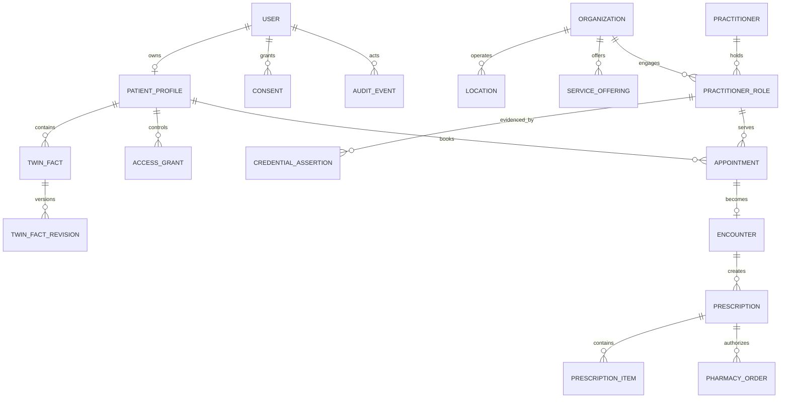

# Data model

The canonical store is PostgreSQL. UUID primary keys, UTC timestamps, optimistic `version` fields, explicit lifecycle enums, and immutable history records are used. Soft deletion is restricted to records whose legal/audit value permits it.

## Twin fact envelope

Every fact stores `kind`, structured `value`, sensitivity, provenance type and identifier, recorded/effective timestamps, verification status, patient confirmation, supersession link, and policy tags. Clinical assertions authored by clinicians cannot be silently overwritten; patients request correction or add context.

FHIR R4 mapping is pragmatic: PatientProfile→Patient, Practitioner→Practitioner, PractitionerRole→PractitionerRole, Organization/Location, Appointment, Encounter, TwinFact subtypes→Observation/Condition/AllergyIntolerance/MedicationStatement, Prescription→MedicationRequest, Consent, Document→DocumentReference, and AuditEvent. Platform verification, directory freshness, companion progress, and entitlement fields are extensions. This is not a claim of full FHIR conformance.

## Directory model

`DirectoryEntity` provides a stable identity and type. Separate Organization, Location, Practitioner, PractitionerRole, ServiceOffering, CoverageArea, Schedule, CredentialAssertion, VerificationReview, SourceRecord, and DirectoryChangeRequest records prevent the common error of flattening a doctor, their role, and a facility into one record.

## Future services

Each new domain owns its tables and publishes stable events such as `appointment.booked.v1`, `twin.fact-confirmed.v1`, `prescription.signed.v1`, and `directory.entity-verified.v1`. Event payloads carry minimum necessary data and schema versions.

