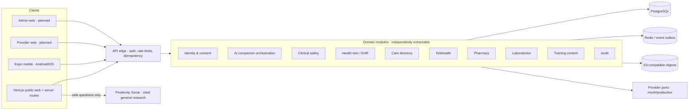
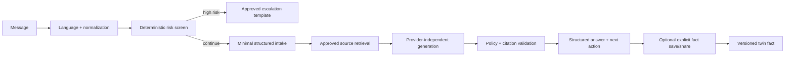

# System architecture

## Decision

Start with a TypeScript modular monolith and extraction-ready domain packages. This preserves transactional integrity and fast iteration for an MVP while enforcing boundaries through public package APIs, domain events, per-module ownership, and architecture tests. Extract a microservice only when independent scaling, regulatory isolation, data residency, failure isolation, or team ownership justifies the operational cost.

## Boundary rules

- Clients depend on versioned API contracts, never database types.
- Domain modules expose commands, queries, events, and schemas through one public entry point.
- Cross-domain writes use an application service and transactional outbox; no module reaches into another module's tables.
- Sensitive data is classified at field level. Logs receive identifiers, decisions, and timing—not clinical message bodies.
- Provider integrations implement ports with capability and health reporting. UI labels mocks as demonstration services.
- AI orchestration is a pipeline. Language, emergency screening, intake extraction, retrieval, generation, safety validation, and citation validation are independently testable stages.
- The public `/get-care` route performs deterministic safety interception before its server-only Perplexity call. Provider keys never cross into browser or Expo bundles, and provider citations are restricted to HTTP/HTTPS before display.

## Companion pipeline

## Extraction sequence

Likely first extractions are notifications/media processing (asynchronous load), AI orchestration (specialized safeguards and scaling), and directory ingestion (large external datasets). Identity/consent, audit, prescription authorization, and core clinical record remain together until distributed consistency requirements are explicitly solved.

## Architecture decisions

- ADR-001: Expo SDK 57 / React Native 0.86 for Android and iOS.
- ADR-002: NestJS 11 API with OpenAPI and Zod contracts.
- ADR-003: Prisma 7 and PostgreSQL 18-compatible schema; SQLite is not a production substitute.
- ADR-004: Reanimated motion tokens with reduced-motion/static fallbacks.
- ADR-005: Training videos are managed content assets, streamed through signed URLs with text equivalents.
- ADR-006: No event sourcing globally; immutable status/provenance histories and an outbox are used where regulation or reconciliation requires them.
